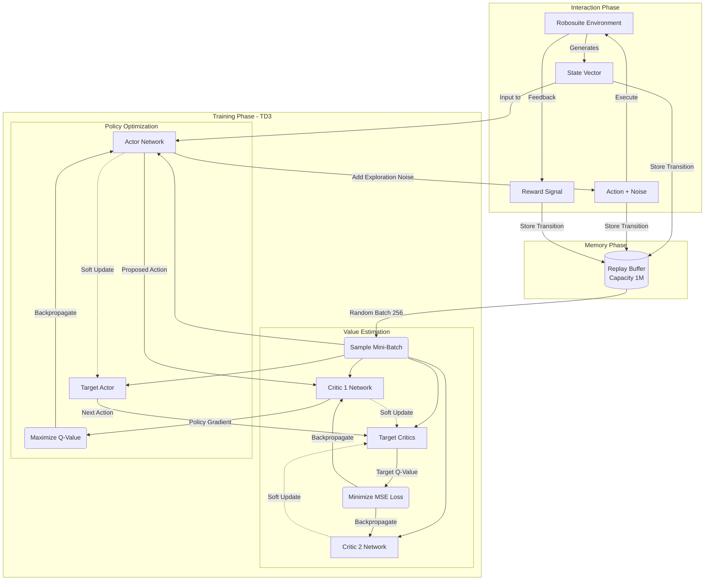

<div align="center">

# 🤖 Autonomous Robotic Arm Control
### using Reinforcement Learning (TD3)


<br>


**Training a Franka Emika Panda robot to open a door using the Twin Delayed DDPG (TD3) algorithm.**

</div>

---

## 📖 Overview

This project demonstrates the power of **Deep Reinforcement Learning** in continuous control robotics. Using the **Robosuite** simulation framework (powered by MuJoCo), we trained an agent to solve the complex `Door` task from scratch.

The agent operates in a continuous state and action space, learning to coordinate 7 degrees of freedom to approach, grasp, rotate, and push the door handle.

## 🚀 Key Features

-   **🧠 Advanced RL:** Custom implementation of **TD3** (Twin Delayed Deep Deterministic Policy Gradient), improving over DDPG by reducing overestimation bias.
-   **🦾 High-Fidelity Sim:** Built on **Robosuite**, offering realistic physics and collisions.
-   **📈 Proven Convergence:** Solved the environment with a stable high score of **~275**.
-   **🛡️ Robustness:** Includes mechanisms for **Checkpointing** and **Best Model Preservation**.

---

## 📊 Performance

The agent was trained for **8,500+ episodes**. It demonstrates a clear "S-curve" learning trajectory, mastering the task after an initial exploration phase.

<div align="center">
  
</div>

---

## 🛠️ Installation

1.  **Clone the Repo**:
    ```bash
    git clone https://github.com/Omkarkkale/Autonomous-Robotic-Arm-Control-using-Reinforcement-Learning.git
    cd Autonomous-Robotic-Arm-Control-using-Reinforcement-Learning
    ```

2.  **Setup Environment** (Recommended):
    *Requires Python 3.10.8*
    ```bash
    python -m venv venv
    venv\Scripts\activate  # Windows
    # source venv/bin/activate # Linux/Mac
    ```

3.  **Install Dependencies**:
    ```bash
    pip install -r requirements.txt
    ```

---

## 🕹️ Usage

### 👁️ Watch the AI (Visualization)
To see the trained agent in action:
```bash
python test.py
```
*Loads the best weights and renders the simulation.*

### 🏋️ Train from Scratch
To start a new training session:
```bash
python main.py
```
*Logs are saved to `logs/` (viewable with TensorBoard).*

---

## 🧠 Model Architecture (TD3)

The solution uses an **Actor-Critic** architecture with **Twin Delayed** stabilization:



*   **Actor:** Maps states to continuous actions (Joint Velocities).
*   **Critic (x2):** Estimates the Q-value of state-action pairs (Twin Critics to reduce bias).
*   **Target Networks:** Normalized using Polyak averaging for stability.

---

## 🔗 References
*   [TD3 Paper (Fujimoto et al.)](https://arxiv.org/abs/1802.09477)
*   [Robosuite Documentation](https://robosuite.ai/)

<div align="center">
  <sub>Built by Omkar Kale</sub>
</div>
